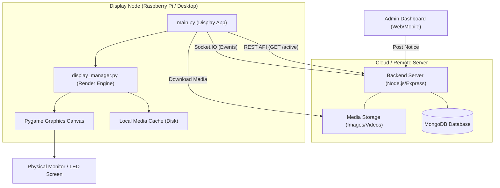
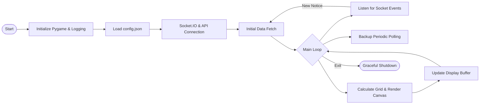
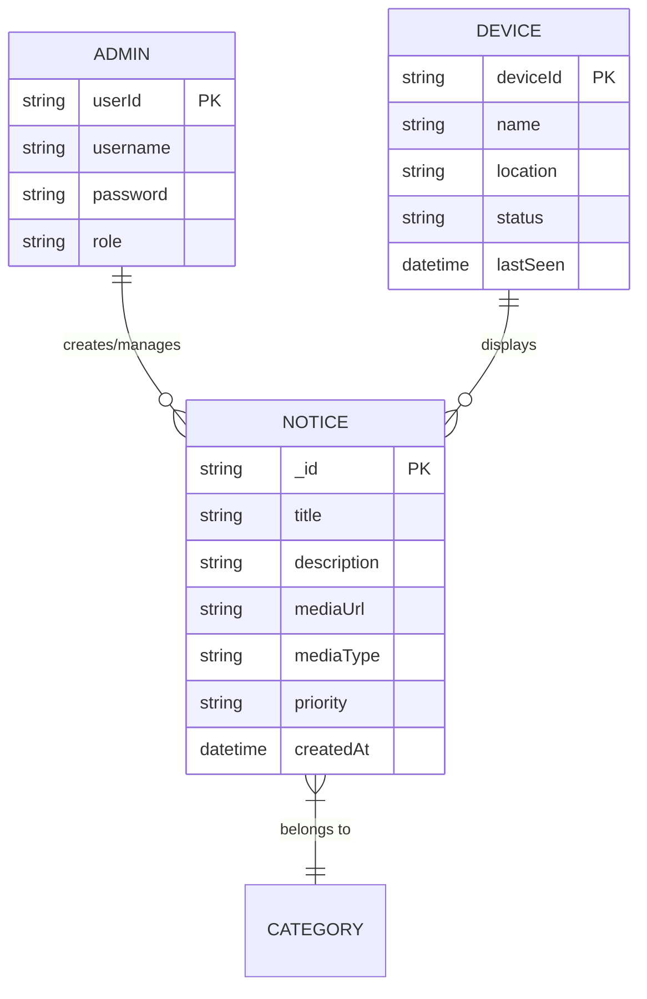
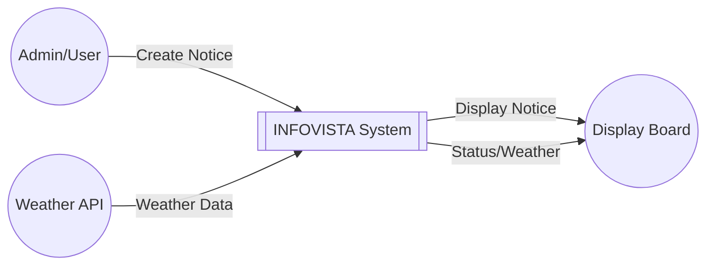
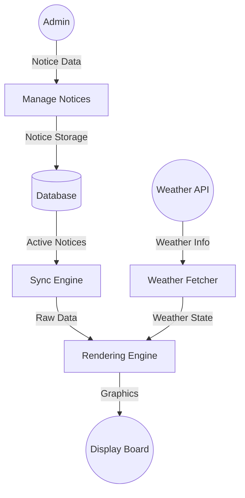
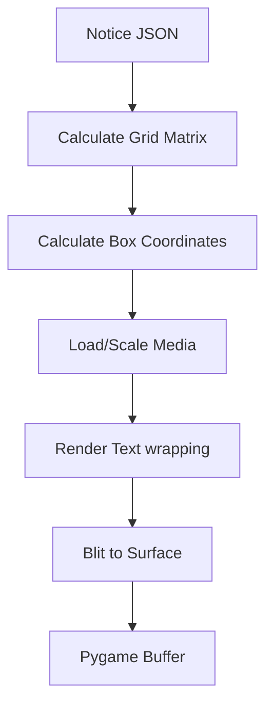
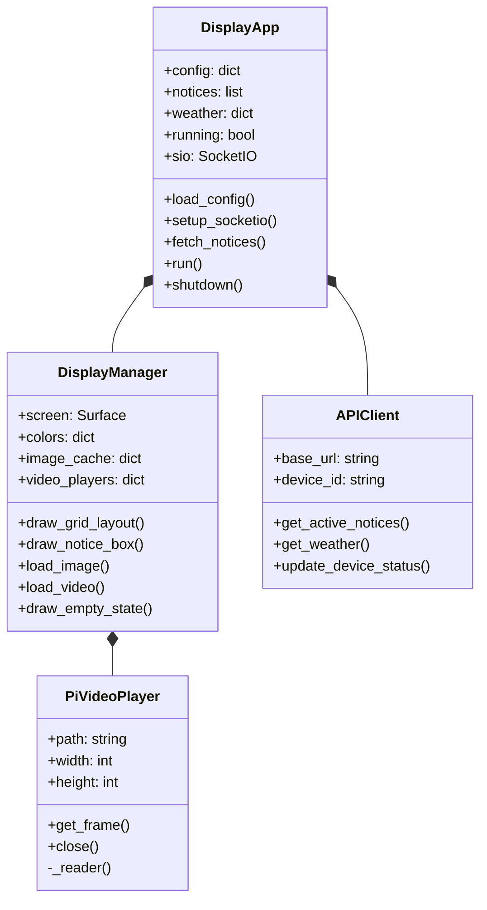
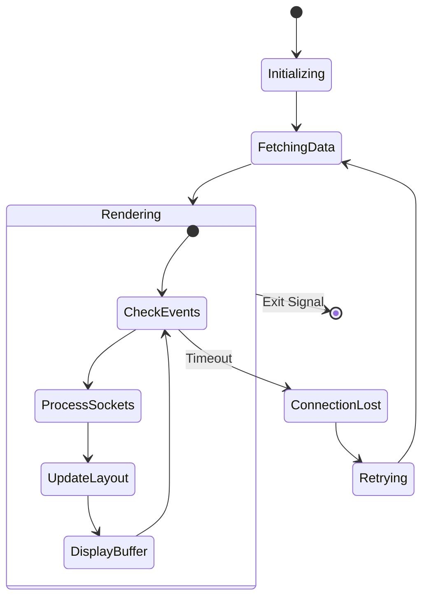
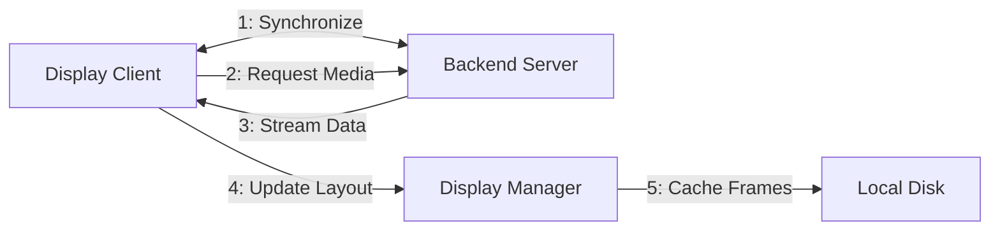
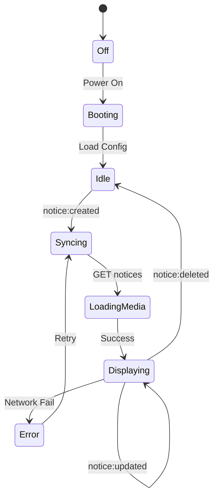

# INFOVISTA Technical Diagrams (UML Style)

This document contains the Mermaid.js source code for all the technical diagrams required for your project report. 

> [!TIP]
> **How to export to PNG:**
> 1. Copy the code block for the diagram you want.
> 2. Go to [Mermaid Live Editor](https://mermaid.live/).
> 3. Paste the code into the left panel.
> 4. Use the "Actions" or "Download" button to save as **PNG**.

---

## 1. System Architecture Diagram (`architecture.png`)


---

## 2. System Flow Diagram (`system_flow.png`)


---

## 3. ER Diagram (`er_diagram.png`)


---

## 4. Data Flow Diagrams (DFD)

### Level 0 (Context Diagram)


### Level 1 (Process Breakdown)


### Level 2 (Rendering Subsystem)


---

## 5. Use Case Diagram (`usecase.png`)
```mermaid
usecaseDiagram
    actor "Administrator" as Admin
    actor "Display Device" as Node
    actor "External Server" as Server

    package "INFOVISTA System" {
        usecase "Create notice with media" as UC1
        usecase "Delete / Update Notice" as UC2
        usecase "Monitor Device Heartbeat" as UC3
        usecase "Synchronize Real-time" as UC4
        usecase "Render Notice Grid" as UC5
        usecase "Display Weather & Clock" as UC6
    }

    Admin --> UC1
    Admin --> UC2
    Admin --> UC3
    
    UC4 <-- Node
    Node --> UC5
    Node --> UC6
    
    UC4 -- "WebSocket" -- Server
    UC1 -- "REST" -- Server
```

---

## 6. Class Diagram (`class_diagram.png`)


---

## 7. Sequence Diagram (`sequence_diagram.png`)
```mermaid
sequence_diagram
    participant A as Admin
    participant S as Backend Server
    participant C as Display Client (App)
    participant D as Display Manager (DM)

    A ->> S: Post New Notice (Title, Media)
    S ->> S: Save to DB
    S -->> C: Socket.IO Event (notice:created)
    C ->> S: GET /api/notices/active
    S -->> C: Return JSON Notice List
    C ->> C: Update local notice state
    C ->> D: draw_grid_layout(notices)
    D ->> S: Fetch Media URL
    S -->> D: Return Image/Video Data
    D ->> D: Render & Blit to Screen
```

---

## 8. Activity Diagram (`activity.png`)


---

## 10. Collaboration Diagram (`collaboration.png`)


---

## 11. Statechart Diagram (`statechart.png`)


---

## 12. Component Diagram (`component.png`)
```mermaid
graph TD
    subgraph "Display Application"
        [Socket.IO Client] -- Events --> [App Controller]
        [App Controller] -- Command --> [Display Engine]
        [Display Engine] -- Media --> [Video Player]
        [Display Engine] -- Media --> [Image Loader]
        [Display Engine] ..> [Media Cache]
        [App Controller] -- Requests --> [API Wrapper]
    end
    [API Wrapper] -- HTTP --> [External API]
```

---

## 13. Package Diagram (`package.png`)
```mermaid
graph TD
    subgraph "INFOVISTA Root"
        [backend]
        [android]
        [display-app]
        [docs]
        [diagrams]
    end
    
    subgraph "display-app package"
        [main.py] --> [display_manager.py]
        [main.py] --> [api_client.py]
        [display_manager.py] --> [cache]
    end
```
