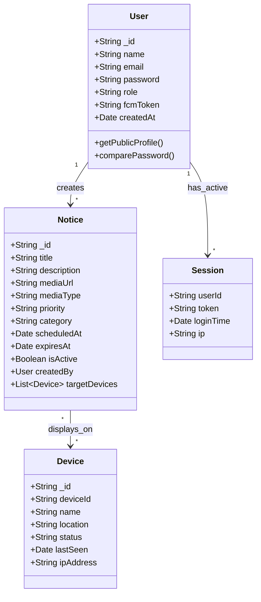
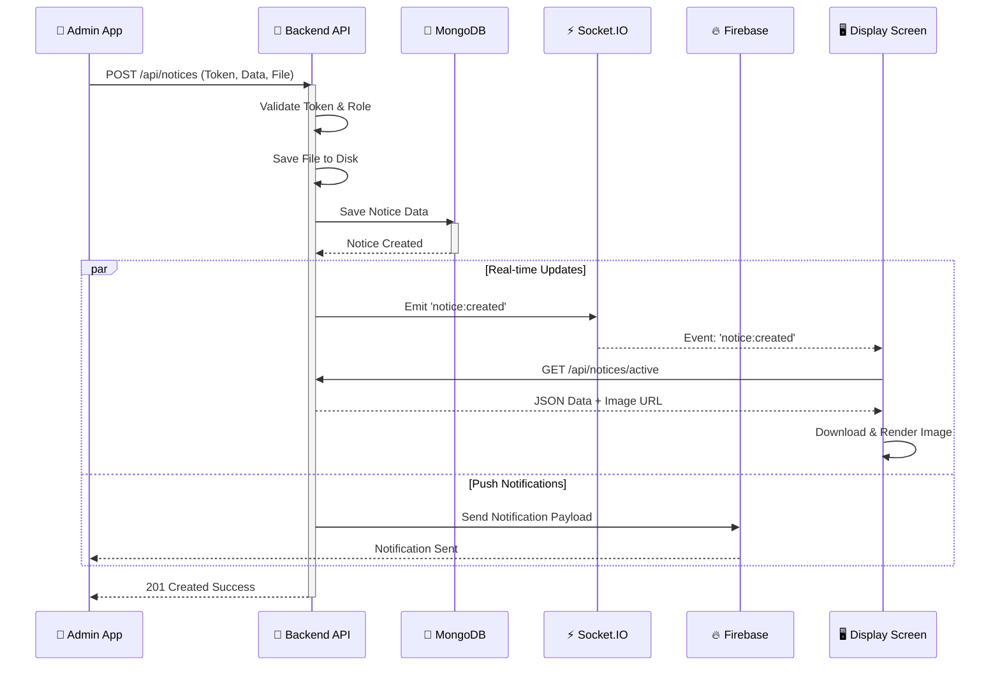
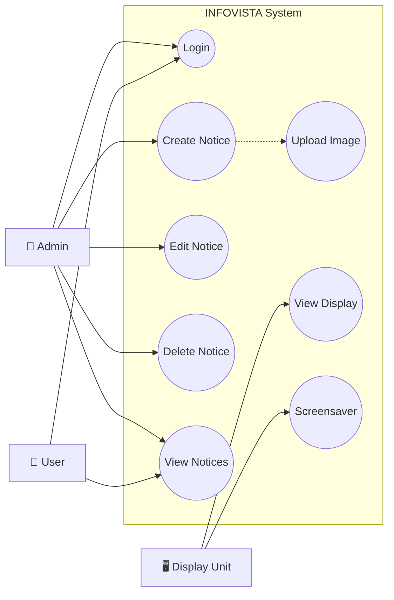
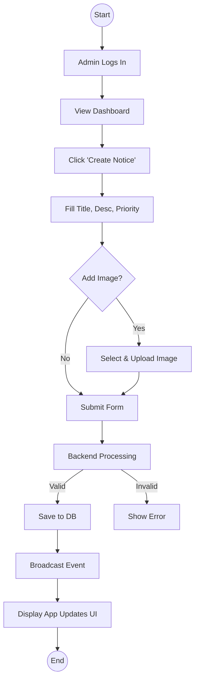

# INFOVISTA - UML Diagrams

## 1. Class Diagram
This diagram represents the structure of the backend models and their relationships.

## 2. Sequence Diagram: Creating a Notice
This diagram illustrates the flow when an Admin creates a new notice.

## 3. Use Case Diagram
High-level overview of user interactions.

## 4. Activity Diagram: Notice Lifecycle
Flow of a notice from creation to display.

